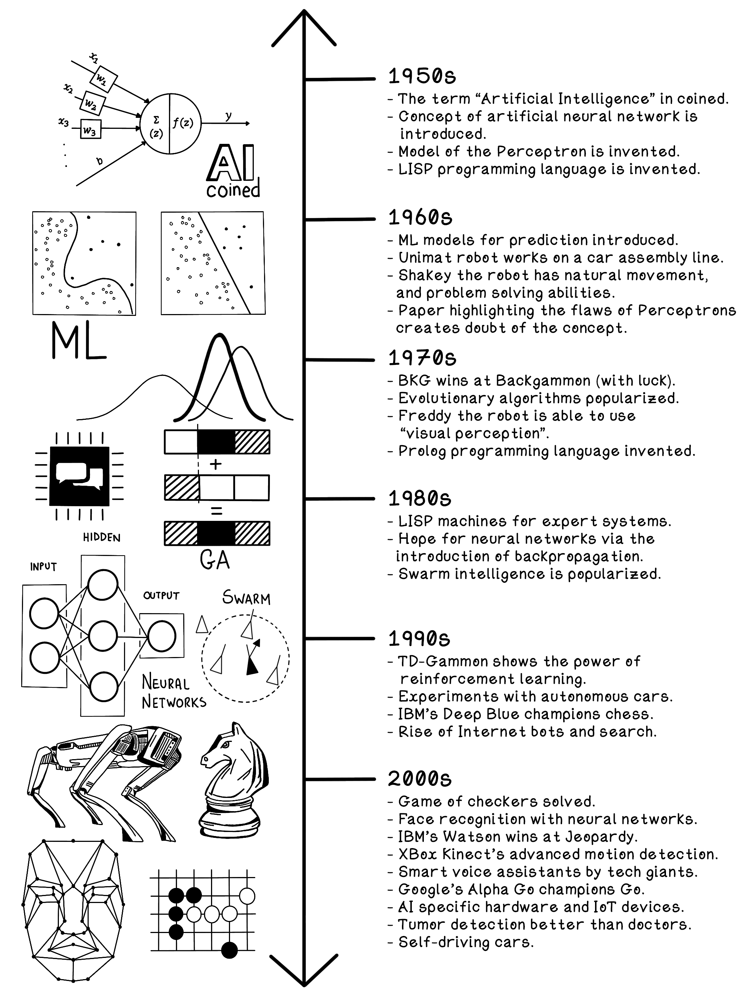
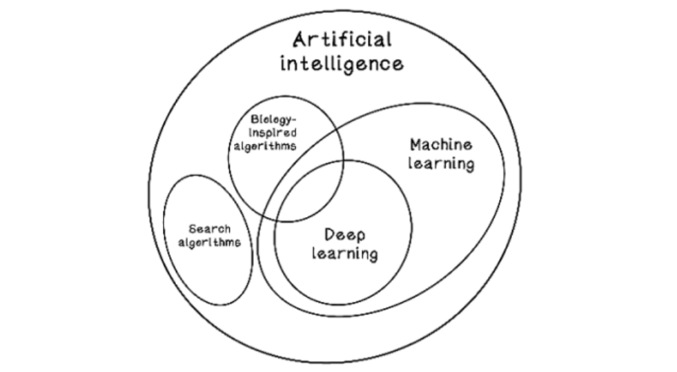

# Intro to AI

## AI History

## Problem types and problem-solving paradigms

Several terms in computer science and AI are used to describe problems. Problems are classified based on the _context_ and the _goal_.

### Search problems: Find a path to a solution

- A search problem involves a situation that has multiple possible solutions, each of which represents a sequence of steps (path) toward a goal.
- Qualified by "better" solutions and quantified by "cheaper" solutions.

### Optimization problems: Find a good solution

- Optimization problems usually have an enormous number of possibilities, each of which differs in how well it solves the problem.
- __Global and local best__: A local best solution is the best solution within a specific area in the search space, and a global best is the best solution in the entire search space.

### Prediction and classification problems: Learn from patterns in data

- Prediction problems are problems in which we have data about something and want to try to find patterns.
- Classification problems are similar to prediction problems, but instead of trying to find an exact prediction such as fuel consumption, we try to find a category of something based on its features.

### Clustering problems: Identify patterns in data

- Clustering problems include scenarios in which trends and relationships are uncovered from data. 
- Clustering aims to find relationships in data even when a precise question is not being asked.

### Deterministic models: Same result each time it's calculated

- Deterministic models are models that, given a specific input, return a consistent output. 

### Stochastic/probabilistic models: Potentially different result each time it’s calculated

- Probabilistic models are models that, given a specific input, return an outcome from a set of possible outcomes.

## Levels of AI

### Narrow intelligence: Specific-purpose solutions

- Narrow intelligence systems solve problems in a specific context or domain.
- These contexts and domains can be combined to create something greater, ie. voice assistants for various domains.

### General intelligence: Humanlike solutions

- General intelligence is humanlike intelligence. Encompasses memory, spatial reasoning through visual inputs, use of knowledge, and more. 

### Super intelligence

- Able to reason about things beyond our understanding, and dominate humans
- Speculative at this point.

## Old vs New AI

### Old

- Systems in which people encoded rules that cause an algorithm to exhibit intelligent behavior via in-depth knowledge of the problem or trial-and-error.
- Example: manually creating a decision tree and the rules and options in the entire decision tree.
- Search algorithms are often seen as old AI

### New

- Systems in which models learn from data and create their own rules that perform as accurately as human-created rules.
- May be able to find patterns in data that a person may never find, or take a long time to find.

__AI categories and overlap__

---
