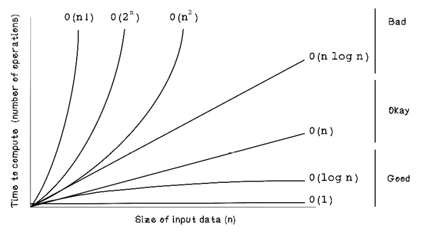
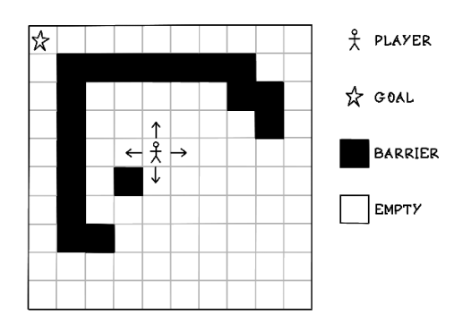
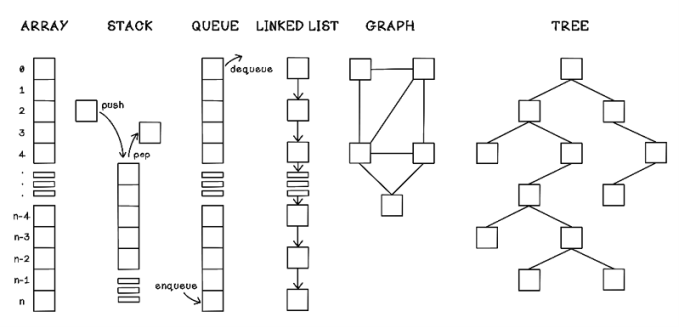
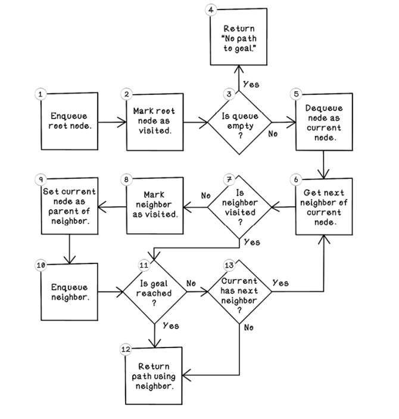
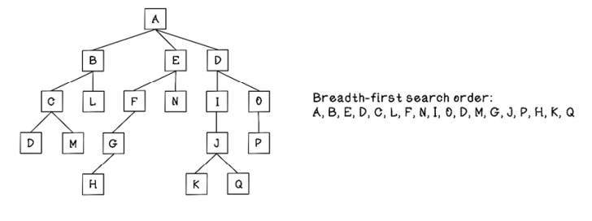
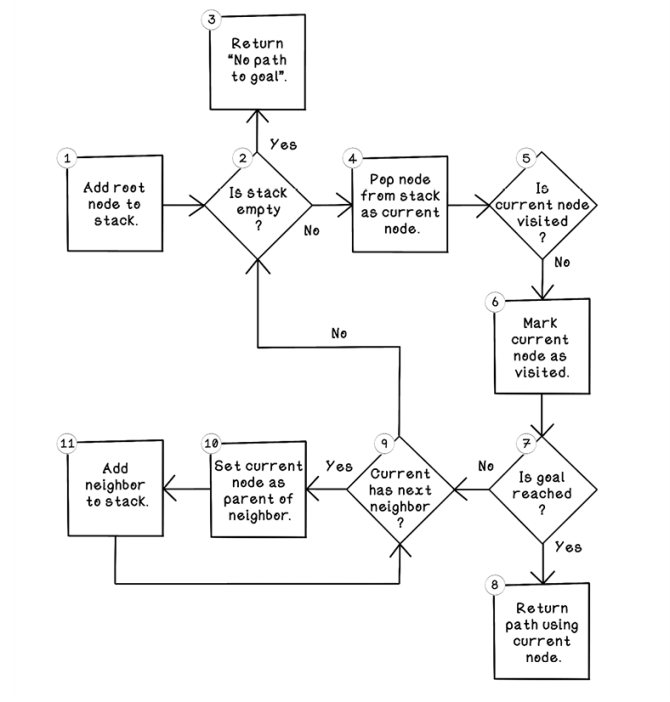
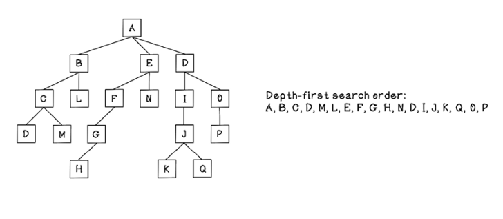
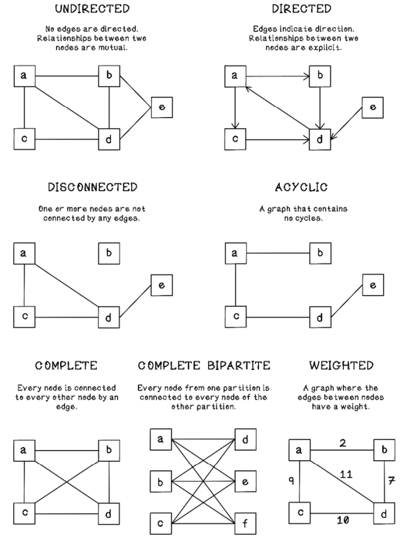
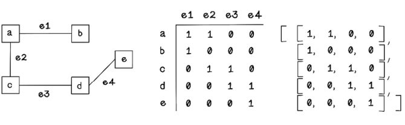
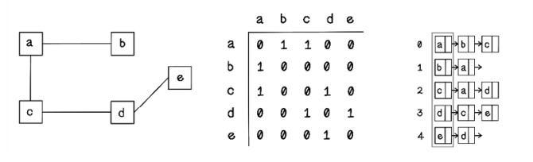

# Ch.2 Search Algorithms

> Searching involves evaluating future states toward a goal with the aim of finding an optimal path of states until the goal is reached. This chapter centers on different approaches to searching depending on different types of problems.

## Cost of computation: The reason for smart algorithms

- _Big O notation_ is used to describe the complexity of a function or algorithm. 
- Big O notation models the __number of operations__ required as the input size increases.

| Types of operation | Cost   | 
|:-------------------------------------------|:-------|
| Single operation that prints `hello world` | __O(1)__ | 
| Function that iterates over a list and prints each item | __O(n)__ | 
| Function that compares every item in a list with every item in another list | __O(n2)__ | 

__Big O complexity chart__

## Representing state: Creating a framework to represent problem spaces and solutions

- When representing data and information in a way that a computer can understand, we need to encode it logically so that it can be understood objectively.
- Distinction between data and information: __data__ is raw facts, __information__ is an interpretation of those raw facts that provides insight.

### Example: Finding shortest path in a maze

- Data: Each individual distance traveled in the maze is data.
- Information: Sum of total distance traveled.

## Data Structures

- Data structures are concepts in computer science used to represent data in a way that is suitable for efficient processing by algorithms.
- A data structure is an abstract data type consisting of data and operations organized in a specific way.
- The data structure we use is influenced by the context of the problem and the desired goal.

__Data structure used with algorithms__

## Uninformed search: Looking blindly for solutions

- Uninformed search is also known as unguided search, blind search, or brute-force search.
- Have no knowledge of the domain of the problem apart from the representation of the problem (usually a tree)
- __Depth-first search__ (DFS) explores a specific path from the start until it finds a goal at the utmost depth. __Breadth-first search__ (BFS) explores all options at a specific depth before moving to options deeper in the tree.

### Breadth-first search: Looking wide before looking deep

- BFS visits all children of nodes at a specific depth before visiting the next depth of child until it finds a goal leaf node.
- Best implemented by using a first-in, first-out (FIFO) __queue__ in which the current depths of nodes are processed, and their children are queued to be processed later

__BFS flow chart__

__Order of processed nodes in a tree using BFS__

- In the maze example, the algorithm needs to understand the current position of the player in the maze, evaluate all possible choices for movement, and repeat that logic for each choice of movement made until the goal is reached.
- The number of moves from parent to goal is the __cost__, ie. distance.
- BFS will terminate once it found _a_ goal, not the _best_ goal.

### Depth-first search: Looking deep before looking wide

- DFS starts at a specific node and explores paths of connected nodes of the first child, doing this recursively until it reaches the farthest leaf node.
- Once it reachest farthest leaf node, backtracks and explores other paths to leaf nodes via other child nodes that have been visited.
- Best implemented using last-in, last-out (LILO) __stack__ in which the last object added is processed first.

__Flow of DFS__

__Order of processed nodes in a tree using DFS__

### Use cases for uninformed search algorithms

1. Finding paths between nodes in a network.
2. Crawling web pages: To index web pages, crawlers typically read the information on each page, as well as follow each link on that page recursively.
3. Social network connections

## More graph categories

## More ways to represent graphs

### Incidence matrix

- An incidence matrix uses a matrix in which the height is the number of nodes in the graph and the width is the number of edges.
- Can be stored as matrix array (list of lists)
- If a node is not connected by a specific edge, the value `0` is stored. 
- If a node is connected by a specific edge as the receiving node in the case of a directed graph, the value `-1` is stored. 
- If a node is connected by a specific edge as an outgoing node or connected in an undirected graph, the value `1` is stored.

__Representing a graph as an incidence matrix__

### Adjacency list

- An adjacency list uses __linked lists__ in which the size of the initial list is the number of nodes in the graph and each value represents the connected nodes for a specific node.

---
