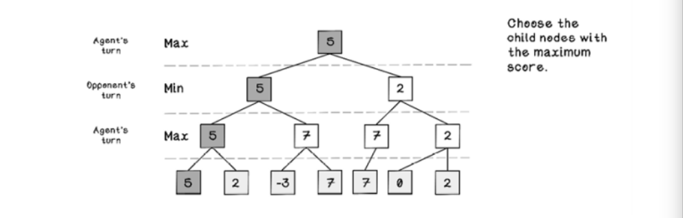

# Ch.3 Intelligent Search

## Informed Search (or "heuristic search")

- __Informed search__ means that the algorithm has some context of the specific problem being solved.
- __Heuristics__ is a rule or set of rules used to evaluate a state. Used when clear method for finding an optimal solution is not possible.
  - Examples for GPS system: "“Good paths minimize time in traffic and minimize distance traveled” or “Good paths minimize toll fees and maximize good road conditions.”
  - Example for copyright audio detection: Minimize difference of distribution of frequencies between two clips.


### Maze problem revisited

Suppose movements in each direction had different _costs_.  The heuristic can be defined as "Good paths minimize cost of movement and minize total moves to reach the goal"

__All possible movement options represented as a tree - 25 is lowest cost__


### Though experiment: Mining costs

> Several miners specialize in different types of mining, including diamond, gold, and platinum. All the miners are productive in any mine, but they mine faster in mines that align with their specialties. Several mines that can contain diamonds, gold, and platinum are spread across an area, and depots appear at different distances between mines. If the problem is to distribute miners to maximize their efficiency and reduce travel time, what could a heuristic be?

__Heuristic__: Send each specialist to the depot closest to them, ie. __minimizing assigning miners to mines that are not their specialty AND minimizing the distance traveled to depots__.

### A\* search ("A-star search")

From wiki:

> A\* is an informed search algorithm, or a best-first search, meaning that it is formulated in terms of weighted graphs: starting from a specific starting node of a graph, it aims to find a path to the given goal node having the smallest cost (least distance travelled, shortest time, etc.). It does this by maintaining a tree of paths originating at the start node and extending those paths one edge at a time until its termination criterion is satisfied.Function for the A\* search algorithm

- BFS visit all nodes on each depth, DFS search all nodes down to final depth before traversing back.
- A\* chooses the lowest weight at each depth.
- A\* doesn't know the costs of all nodes up-front, so its solution may not be the global optimal solution.
- The A\* algorithm uses a similar approach to the depth-first search algorithm but intentionally targets nodes that are cheaper to visit.
- A stack is used to process the nodes, but the stack is __ordered by cost__ ascending every time a new calculation happens.
- Computes more efficiently than uninformed search algorithms, because it ignores nodes that cost more than nodes already visited.

__A\* search function__

```
f(n) = g(n) + h(n)

where:
g(n) = cost of the path from start node to node n
h(n) = cost from the heuristic function for node n
```

__Flow chart of A\* algorithm__ 


## Adversarial search: Looking for solutions in a changing environment

- _Adversarial_ problems require us to anticipate, understand, and counteract the actions of the opponent in pursuit of a goal.
- Example: Connect Four, two players competing against each other to get 4 adjacent tokens.


### Min-max search: Simulate actions and choose the best future

> Min-max search aims to build a tree of possible outcomes based on moves that each player could make and favor paths that are advantageous to the agent while avoiding paths that are favorable to the opponent. 

- Min-max attempst to discover as many states in the future as possible, limited to a specified depth.
  - Depth is limited by memory/computation limits.
- Depth is directly linked to __number of turns between both players__.
  - Depth of 4 = each player take 2 turns.
- Heuristics: defined externally, not learned by algorithm.
  1. For the agent's turn, choose the child nodes with the maximum score.
  2. For the opponent's turn, choose the child nodes with minimum score.
  3. Work your way up from the bottom of a tree to the parent node.
  4. Choose the final path with the highest score for agent and lowest score for opponent.

__Example of Min-max tree (Max = agent's turn, Min = opponent's turn)__



(Note to self: This concept is quite hard to understand - need to revisit with some practical examples.)


### Alpha-beta pruning: Optimize by exploring the sensible paths only

__Alpha-beta pruning__ is a technique used with the Min-max search algorithms to short-circuit areas of the game tree that are known to produce poor solutions.  This saves computation resources since suboptimal paths are ignored.

__An example of alpha-beta pruning__


---


